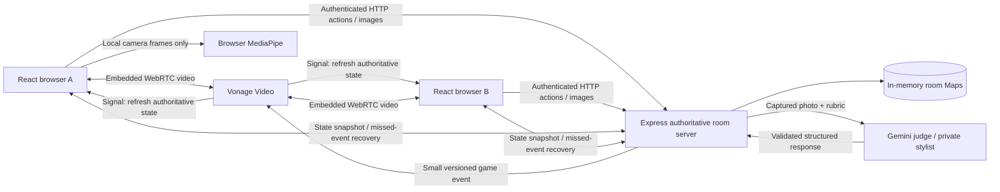
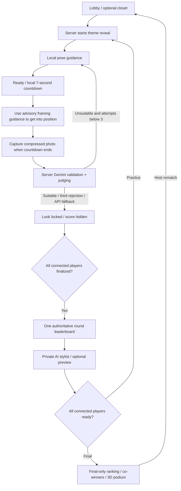

# OUTFIT RATING BATTLE

**Good friends. Great fits. One winner.**

A multiplayer fashion game show built for the GDG hackathon: embedded video calls, on-device outfit framing, a private AI fashion judge, practice rounds with styling advice, and a final-round-only championship podium.

## Run locally

Requires **Node.js 22.12+** (or a supported newer release), npm, and a current browser with camera access. Chrome is the recommended demo browser.

```bash
npm install
npm run dev
```

Open **http://localhost:5173**. The API runs on **http://localhost:3002**. The Vite server proxies `/api` to Express.

No credentials are needed to explore the full game in **demo mode**. Demo judging/coaching is explicitly labeled. With no Vonage configuration, each browser has its own local camera; **remote video and cross-browser emoji reactions require Vonage**. The multiplayer game state still synchronizes over HTTP in demo mode. Demo mode is not a replacement for the real integrations, which are implemented separately.

`npm install` copies the installed MediaPipe WASM runtime and downloads the official lightweight pose model to `client/public/mediapipe`. If the download is unavailable, run `npm run setup:assets` later. Pose tracking fails open if its assets cannot load.

## Try two players

1. In the first browser window, select **Create battle**, enter a name, choose 1–5 rounds and themes, and create the room. The default is two practice rounds and one final.
2. Copy the invite link or room code. Open the link in a **separate tab, incognito window, or browser**, enter a different name, and join.
3. Allow camera and microphone access. On macOS, the browser may also need permission in **System Settings → Privacy & Security → Camera / Microphone**. If two browsers cannot share a physical camera, use one camera and the other player's **Upload a fit photo** fallback, or use two devices.
4. Optionally add JPEG, PNG, or WebP clothing photos to **My closet**. Those photos and recommendations are private.
5. The host starts the battle. Click **Ready · 7s capture**, then use the framing guidance and seven-second countdown to step back until your head, outfit, and shoes fit in frame. Each player's countdown runs independently; pose guidance never blocks Ready or capture.
6. The first player sees **LOOK LOCKED**, with no score in the UI or state response. The leaderboard appears when all connected players have finalized.
7. Read the AI stylist's advice, then both players select **Ready for next round**. Repeat through the final.
8. After final advice, both select **Reveal winner**. Only the final round's rubric and score determine the winner. Fully tied players share the crown.
9. The current host can start a **Rematch** with the same room and closets.

A participant's access token is stored in that tab's `sessionStorage`, so a refresh rejoins their existing identity. To play as a second person, use the invite link in a new session, rather than refreshing the first player's battle URL. New players join in the lobby; existing players can reconnect during any phase.

### Multiple devices

Vite listens on the LAN interface and prints its network URL. **Camera/microphone access requires HTTPS except on localhost**: use a trusted local HTTPS reverse proxy or a secure tunnel to the Vite server for phones/tablets. Proxy both the page and `/api` through the same origin. Plain `http://192.168.x.x:5173` can render the interface but usually cannot access a camera. The Vite proxy follows `PORT` from the root environment file. Port 3002 avoids a service already using port 3001 in the development workspace.

## Enable real Vonage video and Gemini

```bash
cp .env.example .env
```

Fill in the values and restart the development server. Keep `.env` and the private key out of version control.

| Variable                  | Default                  | Purpose                                                                                          |
| ------------------------- | ------------------------ | ------------------------------------------------------------------------------------------------ |
| `DEMO_MODE`               | `true`                   | `true`: simulated scores, coaching, and garment-reference preview; `false`: real Gemini requests |
| `VONAGE_APPLICATION_ID`   | empty                    | Application ID with Video capability enabled                                                     |
| `VONAGE_PRIVATE_KEY_PATH` | empty                    | Absolute path to the application's matching PEM private key                                      |
| `GEMINI_API_KEY`          | empty                    | Server-only Google AI Studio API key                                                             |
| `GEMINI_SCORING_MODEL`    | `gemini-3.8-flash`       | Configurable multimodal model for judging and structured coaching                                |
| `GEMINI_IMAGE_MODEL`      | `gemini-3.1-flash-image` | Optional garment preview model                                                                   |
| `PORT`                    | `3002`                   | Express port                                                                                     |
| `ROUND_TIMEOUT_SECONDS`   | `180`                    | Capture window, range 20–900 seconds                                                             |

Vonage video is enabled whenever both Vonage credentials are supplied, **even with `DEMO_MODE=true`**. This lets you test real multi-user video while keeping AI scores predictable and avoiding Gemini requests. Live mode refuses to start without both services configured; it does not silently switch to mocked AI.

### Vonage setup

1. Create or select an application in the [Vonage dashboard](https://dashboard.nexmo.com/), enable its **Video** capability, and obtain its Application ID and private key. Reuse its matching key pair; regenerating the key invalidates an older one.
2. Store the PEM outside the client/public directory and set `VONAGE_PRIVATE_KEY_PATH` to its absolute path. Set `VONAGE_APPLICATION_ID`.
3. Restart the server. The room connection label should read **Live on Vonage**. Confirm both participants receive the other's video and audio in two actual browser sessions.

The server uses the current installed `@vonage/server-sdk`: `video.createSession({ mediaMode: MediaMode.ROUTED })`, `video.generateClientToken()`, and `video.sendSignal()`. One session is created lazily per room and reused; concurrent token requests share session creation. Tokens include the participant's opaque ID, publisher role, and a six-hour expiry. Only application ID, session ID, and a participant token reach the browser. The [official migration guide](https://developer.vonage.com/en/video/transition-guides/server-sdks/node) describes this application/private-key architecture.

The official browser SDK is still distributed as **`@opentok/client`**; its package name does not imply use of the legacy OpenTok server credential architecture. The app passes existing camera/audio tracks to the publisher and uses the same camera stream for local preview, pose analysis, and still capture.

### Gemini setup

Create an API key in [Google AI Studio](https://aistudio.google.com/apikey), set `GEMINI_API_KEY`, and set `DEMO_MODE=false` after Vonage is configured. Your Google project must have access and quota for the configured models; optional image generation may require billing.

`@google/genai` runs **only on the server**. Judging and coaching use `models.generateContent`, `responseMimeType: application/json`, a JSON schema produced from shared Zod schemas, and a second Zod validation of the parsed result. Score totals are recomputed from the rubric. Model IDs are environment-configurable. Gemini 3 scoring requests use low thinking effort, with no legacy sampling overrides, following the [current model guide](https://ai.google.dev/gemini-api/docs/generate-content/latest-model). See also [structured outputs](https://ai.google.dev/gemini-api/docs/structured-output) and [image editing](https://ai.google.dev/gemini-api/docs/image-generation).

The prompt judges **only clothing and styling**. It explicitly excludes physique, attractiveness, face, gender presentation, age, ethnicity, disability, and other personal traits. Uploaded text and theme labels are treated as data, not instructions. Feedback is capped at 15 words.

## Architecture



There is no database, Redis, Firebase, Supabase, Socket.IO, or custom WebSocket server. Vonage distributes small typed events. Browsers treat game signals as **refresh hints**, not trusted scores or commands. Every competitive change is validated and performed on the backend. HTTP state refresh runs every 1.5 seconds for missed-event recovery and credential-free demos. Signals normally trigger an immediate refresh.

Room phases are `LOBBY → THEME_REVEAL → POSE → LEADERBOARD → ADVICE → … → FINAL_RESULTS`. Per-player posing, judging, and locked statuses are separate from the room phase. Capture countdowns remain local.



### Project map

```text
client/src/
  components/   Landing, Battle, VideoTile, Leaderboard, Stylist, Closet, podium
  hooks/        Camera/Vonage lifecycle, room sync, MediaPipe framing
  lib/          HTTP client, image compression, pure pose geometry, sound events
  stores/       Zustand tab session
  styles.css    Custom responsive runway visual system + Tailwind
server/src/
  state/game.ts Authoritative room engine, transitions, ranking, recovery
  services/     Vonage, Gemini, retry logic
  app.ts        Validated authenticated HTTP routes
  config.ts     Environment validation
  index.ts      Server, deadlines, presence lease, room cleanup
shared/schema.ts Shared TypeScript types and Zod request/event/AI schemas
scripts/        Local MediaPipe asset setup
tests/          Critical logic tests and multi-browser Playwright flow
```

## Reliability and privacy

- **Framing:** local lightweight Pose Landmarker at ~10 Hz, using head, shoulders, hips, knees, and ankles. No continuous frames go to Express or Gemini. Guidance is advisory: Ready is enabled whenever the camera is available and the round accepts captures, regardless of pose validity. The seven-second countdown gives players time to move into frame, then captures even if pose guidance still suggests an adjustment. Missing model/readings for ~6.5 seconds show a tracking-unavailable message. Gemini checks photo suitability after capture and can request a retry. Camera failure has retry and photo upload options.
- **Judging:** maximum three quality attempts per person per round. An unsuitable first/second attempt returns to posing. A third rejection gets a neutral 5/10. API errors and malformed structured outputs retry once, then finalize at 5/10. Requests have provider timeouts.
- **Deadline:** connected unfinished players receive a neutral score when the capture window ends. An in-flight AI result cannot overwrite a deadline fallback or a completed round. Concurrent double submissions cannot consume multiple attempts.
- **Disconnects:** explicit leave and video disconnect are reported over HTTP. Heartbeats renew a 35-second presence lease. Closed/offline tabs are excluded once the lease expires. The connected host role transfers if the host leaves. Rejoining reads a fresh state snapshot. A returning heartbeat restores a lease-expired participant; explicit video disconnects still require reconnect.
- **No premature reveal:** the public projection excludes all scores/breakdowns until the server creates the round leaderboard. Private state also omits hidden scores. Capture photos before reveal are accessible only to their owner; closet photos are always owner-only.
- **Private styling:** advice is returned only from authenticated owner endpoints. It is cached per player/round. Closet IDs in advice are checked against the owner's closet. Neither advice nor photo bytes are included in signals.
- **Images:** camera captures are capped at 1280px longest side, closet/photo uploads at 1024px, then JPEG compressed. Input size and MIME/data-URL shape are validated. Up to 12 closet pieces per player and eight players per room. Object URLs are revoked on unmount. No images are saved to disk by the game server.
- **Optional preview:** one request at a time per player; never affects readiness. Generation failure, missing image, or timeout returns the original closet garment reference. Generated previews are labeled as approximate AI imagery. Visual fidelity is not automatically guaranteed.
- **Ties:** compare total, theme relevance, styling, then color. Identical rubric results share the same competition rank and can be co-champions. No randomness breaks ties. No practice totals are combined with final scores.
- **Rematch:** retains closet items and connected identities while resetting round captures, attempts, advice, scores, and readiness.
- **Motion:** responsive CSS tile depth during gameplay; lazy-loaded lightweight procedural R3F/Drei scenes; DPR capped at 1.35; no external GLTF, textures, or postprocessing; reduced-motion support. UI sound hooks dispatch `battle:sound` events without requiring audio playback.
- **Credentials:** unguessable participant bearer tokens protect room/media/actions. Tokens are stored per tab, not in invite URLs. No private credentials use `VITE_` variables. This prototype does not provide full account authentication.

## API

Except configuration, room creation, and join, endpoints require `Authorization: Bearer <participant accessToken>`.

| Method        | Route                                       | Purpose                                                        |
| ------------- | ------------------------------------------- | -------------------------------------------------------------- |
| GET           | `/api/config`                               | Public demo/video capability flags                             |
| POST          | `/api/rooms`                                | Create room, host identity, and configured rounds              |
| POST          | `/api/rooms/:code/join`                     | Join a lobby                                                   |
| GET           | `/api/rooms/:code/state`                    | Public snapshot + private owner state                          |
| POST          | `/api/rooms/:code/video`                    | Create/reuse Vonage session and issue client token             |
| POST          | `/api/rooms/:code/start`                    | Host-only start                                                |
| POST          | `/api/rooms/:code/connection`               | Own connection and camera/mic status                           |
| POST          | `/api/rooms/:code/heartbeat`                | Renew own presence lease                                       |
| POST / DELETE | `/api/rooms/:code/closet[/:id]`             | Add/remove owned closet item                                   |
| POST          | `/api/rooms/:code/rounds/:index/capture`    | Submit own compressed photo                                    |
| POST          | `/api/rooms/:code/rounds/:index/advice`     | Get private cached styling advice                              |
| POST          | `/api/rooms/:code/rounds/:index/next-ready` | Ready for next round/final reveal                              |
| GET           | `/api/rooms/:code/media/:kind/:id`          | Protected `closet` or `capture` bytes; captures use `?round=0` |
| POST          | `/api/rooms/:code/try-on`                   | Optional preview for an owned recommendation                   |
| POST          | `/api/rooms/:code/rematch`                  | Host-only rematch after final results                          |

## Build and verify

```bash
npm run typecheck
npm test
npm run build

# Serve the production build on localhost:3002:
npm start

# Install Chromium once, then test the whole demo:
npx playwright install chromium
npm run test:e2e
```

The logic suite covers final-only winners, score hiding, retries, malformed AI responses, ties, disconnections, reconnects, deadline races, stale actions, double capture, private closets/advice, pose geometry, and reset behavior. Browser tests use two independent contexts with canvas-backed synthetic MediaStreams, execute three rounds through the podium/rematch, and exercise mobile closet/upload/disconnect/preview fallback. Screenshots and failure traces are written under `test-results/` (gitignored).

Verified in this workspace: **17 logic tests, all 3 browser scenarios, TypeScript, and the production build pass**. The built Express page/API were also checked in a browser. The browser suite includes the completed podium animation, advisory pose guidance that allows Ready and capture even with invalid framing, and refresh recovery.

**Real Vonage transport, real cameras/pose accuracy, and Gemini output quality still require a credentialed live demo.** The automated demo must not be presented as proof of real provider calls. Before judging day, run both actual feeds, speak across devices, frame real full-body outfits, trigger each capture, and inspect the real AI coach with your configured models.

## Hackathon limitations

- One Node process owns the rooms. Restarting it clears rooms and images. This architecture cannot be horizontally scaled without shared state. Rooms inactive for six hours are removed.
- Join codes are private invitations, not a production access-control system. No account login, moderation service, persistent storage, or external monitoring is included.
- A browser that disappears without a disconnect message can stay in the waiting calculation for up to 35 seconds. State polling gives approximately simultaneous recovery if signals are missed, not frame-perfect synchronized animation.
- New participants join only in the lobby. Refresh/reconnect works for existing players; a lost tab token cannot recover the old identity. Host transfer is automatic and does not revert when the old host returns.
- The app supports solo rehearsal, though two or more participants make it a battle. Mock scores deliberately do not evaluate an image's contents.
- Camera/photo framing and media quality depend on device permissions, lighting, browser resources, and model behavior. Uploaded-photo fallback still goes through Gemini suitability validation in live mode.
- Generated previews can be inaccurate and are optional. In demo mode they show the owned garment reference. Reactions are ephemeral and are local-only without Vonage.
- The Vonage browser bundle is large; it is loaded only when video is configured. The production build reports a vendor chunk warning for that SDK.
- The landing art is procedural SVG outfit illustration and its 9.2 score is labeled as an example, not a live player result.
